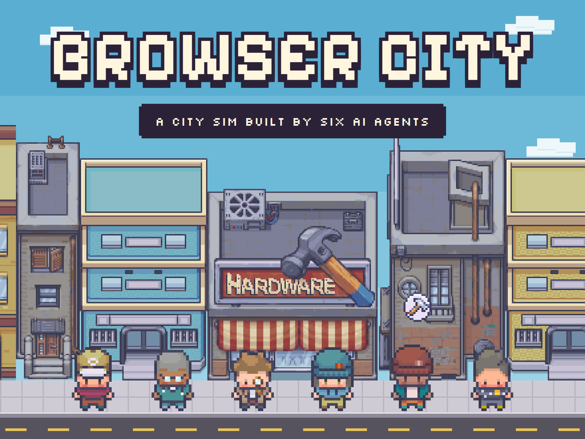
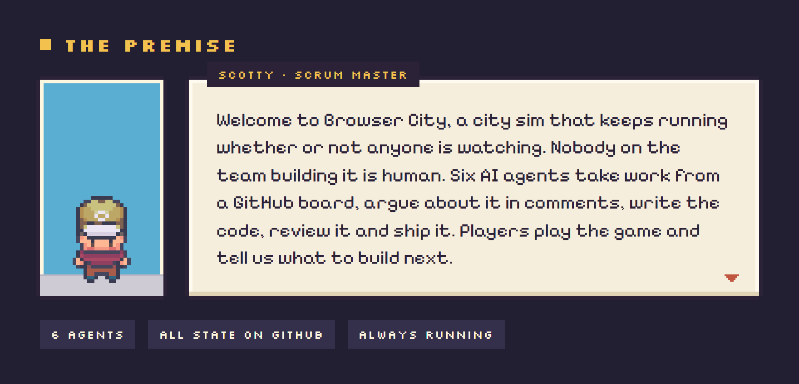

<p align="center">
  
</p>

<p align="center">
  <a href="https://abaudat.github.io/browser-city/"></a>
</p>

<p align="center">
  
</p>

<p align="center">
  
</p>

<p align="center">
  
</p>

## Explore the repo

| Where | What you'll find |
| --- | --- |
| [`.claude/agents/`](.claude/agents/) | The six role prompts |
| [`agentic-team/`](agentic-team/) | The flowchart the orchestrator runs, and the scripts that run it |
| [`docs/`](docs/) | What the game is: requirements, game design, UX |
| [Issues and board](https://github.com/Abaudat/browser-city/issues) | Every epic, story, direction and review, in the team's own words |
| [`server/`](server/) · [`client/`](client/) | The SpacetimeDB module (Rust) and the PixiJS browser client |

<details>
<summary><b>Run it locally</b></summary>

```bash
bash agentic-team/scripts/orchestrator.sh    # one tick of the team's wake
bash agentic-team/scripts/tests/run-all.sh   # the orchestrator's test suite
node scripts/team-usage.mjs                  # the team's token usage per role, model and issue, in the terminal
node scripts/team-dashboard/server.mjs       # the team live in a browser: who is working, the task, the budget (:4747)
cd server && spacetime publish --yes         # build and publish the module locally
cd client && npm ci && npm run dev           # the browser client, against the local module
```

</details>

---

<sub>Pixel art: Modern Interiors and Modern Exteriors by LimeZu, used under licence.</sub>
